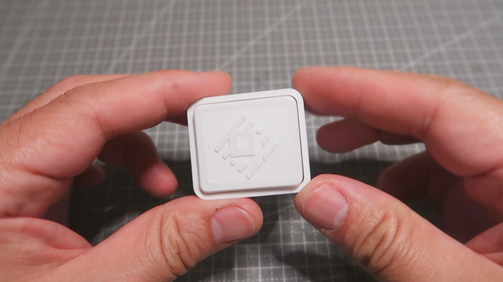
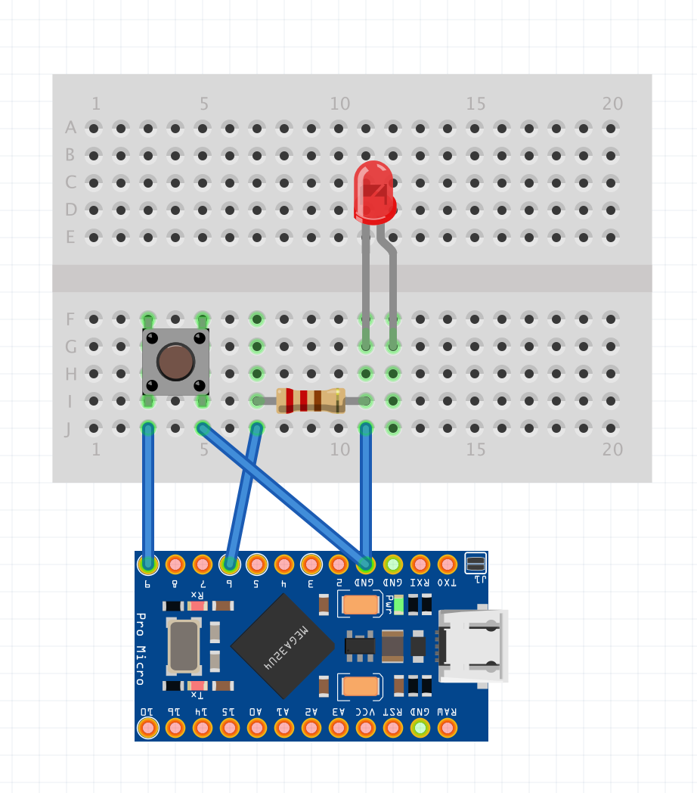

# DIY One-Key Keyboard with Breathing LED Light

Click to see the building process video on [YouTube](https://www.youtube.com/watch?v=HUIpZMjjqk4):

## Why Build This?

Have you ever wanted a custom one-key keyboard dedicated to your most-used app? If you use Raycast as frequently as I do, a personalized, single-key keyboard can greatly enhance your productivity and style. With the availability of microcontrollers, key switches, and a 3D printer, creating a bespoke keyboard is easier than you might think.

## Materials Needed

### Components

- 1 Arduino Pro Micro
- 1 Mechanical keyboard key switch (blue or any other type)
- Wires
- 1 LED
- 1 200 Ohm Resistor
- USB A to Micro USB cable

### Tools Required

- 3D Printer
- Soldering iron

## Design Process

I used Fusion 360, a powerful yet free tool for personal projects, to design the 3D model of the keyboard. It took several iterations to make the design work, ensuring it was both comfortable to use and capable of housing all the necessary components.

## Schematic

### macOS Compatibility

Note that macOS has specific shortcuts for F1 to F12, and F14 and F15 adjust screen brightness. Using keys F20 to F24 might not be supported on macOS. To avoid conflicts, I used F19 for this project.

## Links

- Full article instruction on my website: [andycao.me](https://andycao.me/blog/one-key-keyboard-diy)
- Project on Printable: [One-Key Keyboard with Breathing LED](https://www.printables.com/model/910260-one-key-keyboard-with-breathing-led)
- Project on Thingiverse: [One-Key Keyboard with Breathing LED](https://www.thingiverse.com/thing:6660141)
